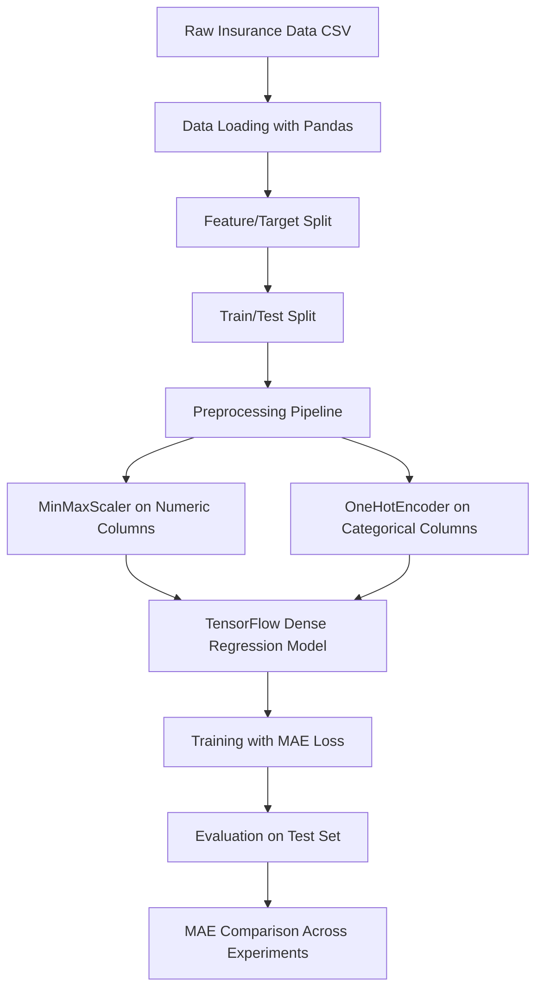

# Neural Network Regression for Medical Cost Prediction

## 1. Project Title
Neural Network Regression for Medical Insurance Cost Prediction

## 2. Overview
This project implements an end-to-end regression pipeline to predict individual medical insurance charges from demographic and lifestyle attributes (`age`, `sex`, `bmi`, `children`, `smoker`, `region`).

From an engineering perspective, the system demonstrates iterative model development: baseline dense neural network training, architecture optimization, and feature preprocessing with train/test-safe transformations.

Why it matters:
- Medical cost estimation is a high-impact regression problem with real-world financial implications.
- The project shows how model quality improves through structured experimentation, not just larger models.
- It reflects practical AI/ML engineering fundamentals: data encoding, normalization, leakage prevention, and metric-driven iteration.

## 3. Features
- TensorFlow/Keras-based neural network regression workflow
- Multiple model iterations with controlled random seed for reproducibility
- One-hot encoding for categorical features
- MinMax scaling for numerical features (`age`, `bmi`, `children`)
- Train/test split with leakage-aware preprocessing fit on training data only
- MAE-based evaluation to compare experimental runs
- Training-curve visualization for optimization diagnostics

## 4. Tech Stack
- Python (Jupyter Notebook workflow)
- TensorFlow / Keras
- scikit-learn (`train_test_split`, `MinMaxScaler`, `OneHotEncoder`, `ColumnTransformer`)
- Pandas
- Matplotlib
- Dataset source: [Machine-Learning-with-R-datasets/insurance.csv](https://raw.githubusercontent.com/stedy/Machine-Learning-with-R-datasets/master/insurance.csv)

## 5. Architecture / Workflow


## 6. Project Structure
```text
Neural-Network-Regression/
+-- neural_network_regression.ipynb   # End-to-end experimentation notebook
+-- README.md                         # Project documentation
```

## 7. Installation
```bash
git clone https://github.com/<your-username>/Neural-Network-Regression.git
cd Neural-Network-Regression
pip install tensorflow pandas scikit-learn matplotlib notebook
```

## 8. Usage
1. Start Jupyter:
```bash
jupyter notebook
```
2. Open `neural_network_regression.ipynb`.
3. Run all cells in order to:
- Load and inspect the insurance dataset
- Train baseline and improved neural network models
- Apply normalized + encoded preprocessing pipeline
- Evaluate MAE improvements on the same test split

## 9. Example Output
Observed test-set MAE from notebook runs:

| Experiment | Configuration (Summary) | Test MAE |
|---|---|---:|
| Model 1 | Dense(10 -> 1), SGD, 100 epochs, one-hot only | 8810.49 |
| Model 2 | Dense(100 -> 10 -> 1), Adam, 100 epochs, one-hot only | 4991.24 |
| Model 3 | Dense(100 -> 10 -> 1), Adam, 200 epochs, one-hot only | 3502.67 |
| Model 4 | Dense(100 -> 10 -> 1), Adam, 500 epochs, normalized + encoded | 3161.50 |

Key takeaway: feature scaling plus architecture/optimizer tuning significantly reduced prediction error compared with the baseline.

## 10. Engineering Insights
- Iterative optimization over one-shot modeling:
  - The project uses staged improvements (architecture, optimizer, epochs, preprocessing) to isolate impact.
- Leakage-aware preprocessing:
  - The column transformer is fit on training data only, then applied to test data.
- Numerical conditioning matters:
  - Neural networks train more effectively when numeric features are scaled.
- Reproducibility consideration:
  - Fixed TensorFlow random seed improves consistency during experimentation.

Design trade-offs:
- Notebook-first approach accelerates experimentation but limits production modularity.
- MAE is interpretable and robust for cost prediction, but additional metrics (RMSE/R2) would enrich analysis.

Scalability thoughts:
- Convert notebook stages into modular Python packages (`data`, `features`, `training`, `evaluation`).
- Add model versioning and experiment tracking for repeatable model governance.
- Expose inference as an API service for backend integration.

## 11. Learning Journey & AI/ML Foundations
### A. Computational & Mathematical Foundations
My technical foundation is rooted in:
- Mathematical modeling of real-world systems
- Numerical methods for computational problem solving
- Algorithmic reasoning and optimization-oriented thinking
- Matrix-style computation patterns central to ML implementations
- Structured data transformation workflows aligned with Pandas-style processing

### B. Current Academic Direction
I am currently pursuing an M.Tech in AI/ML, with active focus on machine learning, deep learning, NLP, and AI systems engineering.

### C. Self-Driven Learning Narrative
This repository is part of my self-driven transition into AI/ML engineering. I use project-based learning to move from theory to implementation by building complete pipelines, testing modeling assumptions, and improving systems through metric-guided iteration.

### D. Project -> AI/ML Mapping
How this project maps to broader AI/ML engineering:
- Regression modeling -> foundation for predictive intelligence systems
- Numerical preprocessing -> directly tied to optimization stability in ML training
- Pipeline orchestration -> mirrors production AI workflows (data -> transform -> train -> evaluate)
- Experimental comparison -> core practice for model selection and performance tuning

### E. Narrative Positioning
This project is part of my transition into AI/ML, where I apply strong foundations in computational modeling and numerical methods to build scalable and intelligent systems.

### F. Core Insight
Even before specializing in AI/ML, I was working with computational algorithms, numerical methods, and system modeling - which form the backbone of modern machine learning systems.

## 12. Challenges & Learnings
Challenges encountered:
- High baseline MAE with minimal architecture and no normalization
- Sensitivity of model performance to optimizer and feature scaling choices
- Need to balance training duration with incremental performance gains

What I learned:
- Data representation quality can be as important as model depth
- Controlled experiments (one change at a time) produce clearer engineering decisions
- Proper preprocessing pipelines are essential for trustworthy evaluation

## 13. Future Improvements
- Add modular Python package structure and CLI training entrypoint
- Introduce experiment tracking (e.g., MLflow/W&B) and artifact versioning
- Add model explainability (feature attribution and error slicing)
- Package trained model for backend deployment (FastAPI inference endpoint)
- Extend to richer objectives: uncertainty-aware predictions and cost-range estimation
- Add CI checks for data validation, model training smoke tests, and reproducibility